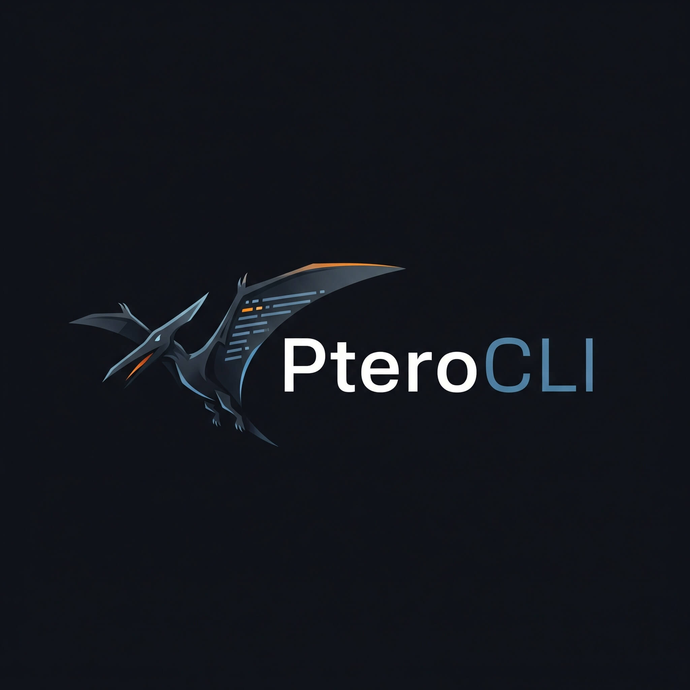

<div align="center">


# PteroCLI

**Manage your Pterodactyl client panel from the comfort of your terminal! 🔌**

</div>

---

## 📖 About

PteroCLI is a command-line interface (CLI) tool that allows you to interact with and manage your Pterodactyl game server panel directly from your terminal. No more need to open a web browser!

This project is built with Node.js and is designed to be fast, efficient, and easy to use.

## ✨ Features

- 🖥️ **Server Management:** Start, stop, restart, and kill your game servers.
- 📺 **Real-time Console:** View your server console and send commands in real-time.
- 📁 **File Management:** Manage your server files directly from the CLI.
- 🤝 **User-Friendly:** Interactive prompts and easy-to-read tables make it simple to use.

## 🚀 Installation

1.  **Clone the repository:**
    ```bash
    git clone https://github.com/FarizzDev/PteroCLI.git
    ```
2.  **Navigate to the project directory:**
    ```bash
    cd PteroCLI
    ```
3.  **Install dependencies:**
    ```bash
    npm install
    ```

## 🎮 Usage

To start PteroCLI, run the following command:

```bash
npm start
```

## 📦 Dependencies

- [axios](https://www.npmjs.com/package/axios): Promise based HTTP client for the browser and node.js
- [chalk](https://www.npmjs.com/package/chalk): Terminal string styling done right
- [cli-table3](https://www.npmjs.com/package/cli-table3): Pretty unicode tables for the command line
- [form-data](https://www.npmjs.com/package/form-data): A library to create readable `multipart/form-data` streams.
- [inquirer](https://www.npmjs.com/package/inquirer): A collection of common interactive command line user interfaces.
- [ws](https://www.npmjs.com/package/ws): A simple to use, blazing fast, and thoroughly tested WebSocket client and server for Node.js

## 📝 License

This project is licensed under the MIT License - see the [LICENSE](LICENSE) file for details.
