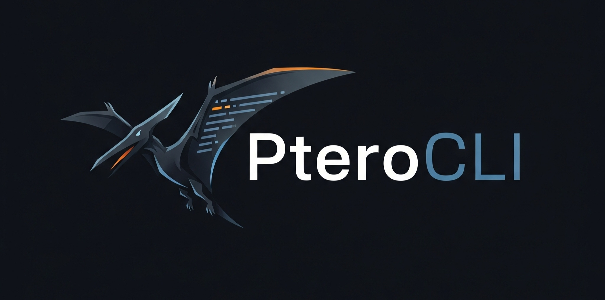

<div align="center">


# PteroCLI

**Manage your Pterodactyl client panel from the comfort of your terminal! 🔌**

</div>

---

## 📖 About

PteroCLI is a command-line interface (CLI) tool that allows you to interact with and manage your Pterodactyl game server panel directly from your terminal. No more need to open a web browser!

This project is built with Node.js and is designed to be fast, efficient, and easy to use.

## ✨ Features

- 🖥️ **Server Management:** Start, stop, restart, and kill your game servers.
- 📺 **Real-time Console:** View your server console and send commands in real-time.
- 📁 **File Management:** Manage your server files directly from the CLI.
- 🤝 **User-Friendly:** Interactive prompts and easy-to-read tables make it simple to use.

## 🚀 Installation

1.  **Clone the repository:**
    ```bash
    git clone https://github.com/FarizzDev/PteroCLI.git
    ```
2.  **Navigate to the project directory:**
    ```bash
    cd PteroCLI
    ```
3.  **Install dependencies:**
    ```bash
    npm install
    ```

## ⚙️ Configuration

The first time you run PteroCLI, it will ask you for your Pterodactyl Panel URL and a Client API Key. Here's how to get them:

### 1. Panel URL (`PTERO_URL`)

This is simply the main URL you use to access your Pterodactyl panel in your web browser.

- **Example:** `https://panel.myhosting.com`

Enter this full URL when prompted. The application will automatically use the base part of it (the origin).

### 2. Client API Key (`PTERO_KEY`)

This key allows PteroCLI to securely access your account.

1.  Log in to your Pterodactyl panel.
2.  Click on your account avatar in the top-right corner and select **"API Credentials"**.
3.  Under the "API Keys" section, you can create a new key.
4.  Enter a description for the key (e.g., "PteroCLI") and leave the "Allowed IPs" field blank (unless you have a static IP and want to restrict access).
5.  Click **"Create"**.
6.  Your API key will be displayed. **This is the only time you will see the full key, so copy it immediately!**
7.  Paste this key into the PteroCLI prompt.

The application will save these details in a `.env` file in the project directory so you don't have to enter them every time.

## 🎮 Usage

To start PteroCLI, run the following command:

```bash
npm start
```

## 📦 Dependencies

- [axios](https://www.npmjs.com/package/axios): Promise based HTTP client for the browser and node.js
- [chalk](https://www.npmjs.com/package/chalk): Terminal string styling done right
- [cli-table3](https://www.npmjs.com/package/cli-table3): Pretty unicode tables for the command line
- [form-data](https://www.npmjs.com/package/form-data): A library to create readable `multipart/form-data` streams.
- [inquirer](https://www.npmjs.com/package/inquirer): A collection of common interactive command line user interfaces.
- [ws](https://www.npmjs.com/package/ws): A simple to use, blazing fast, and thoroughly tested WebSocket client and server for Node.js

## 📝 License

This project is licensed under the MIT License - see the [LICENSE](LICENSE) file for details.
